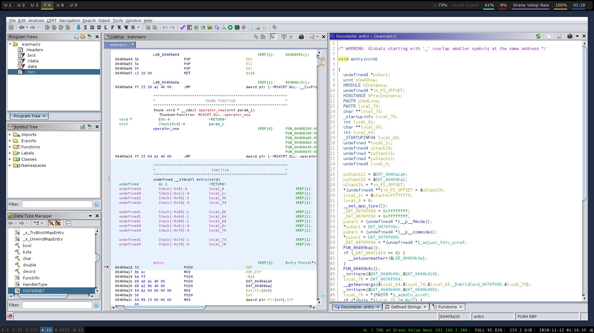
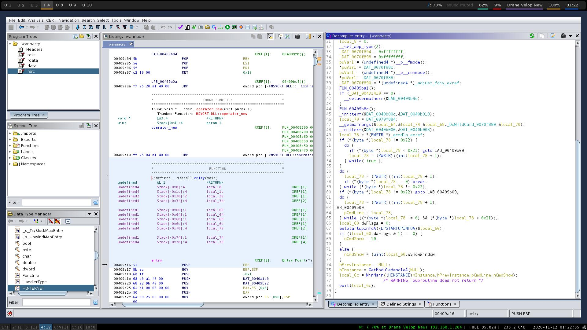
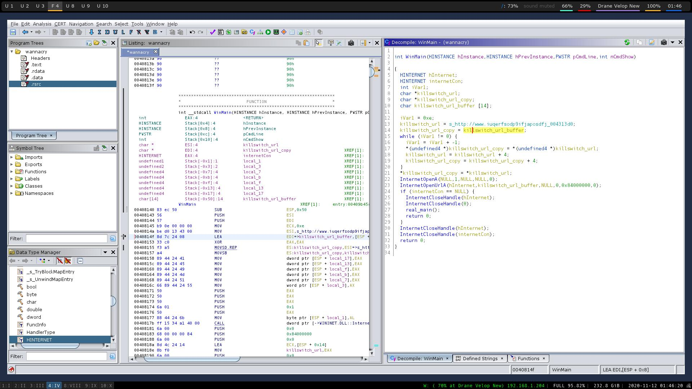
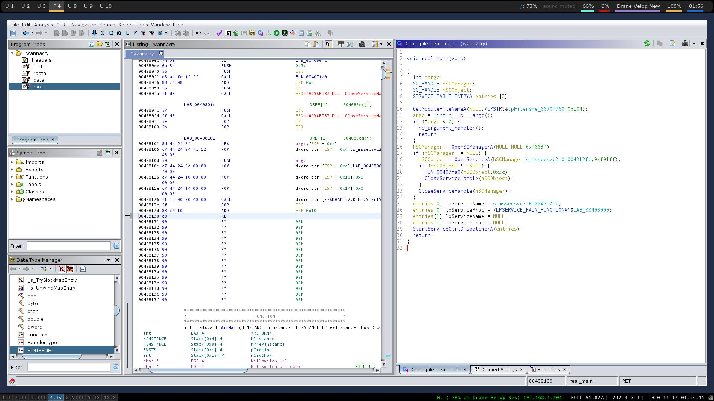
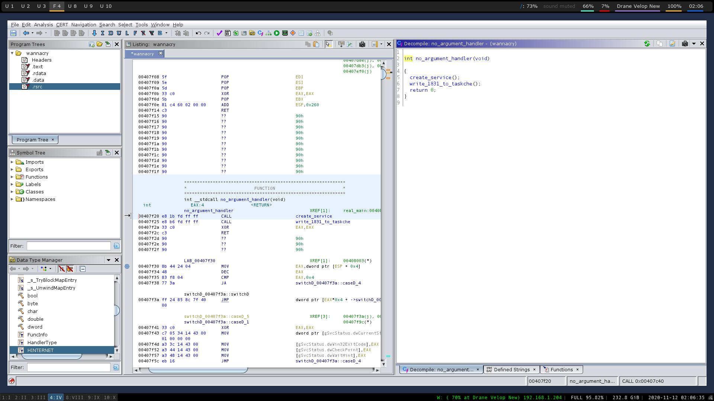
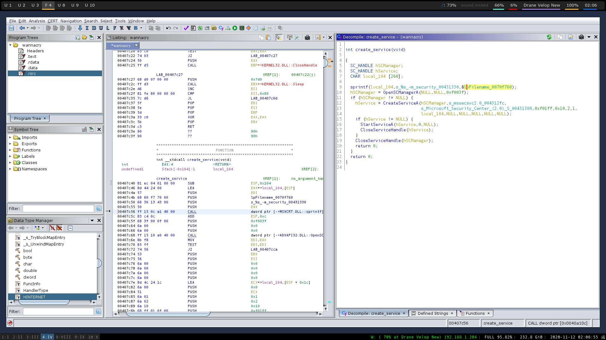
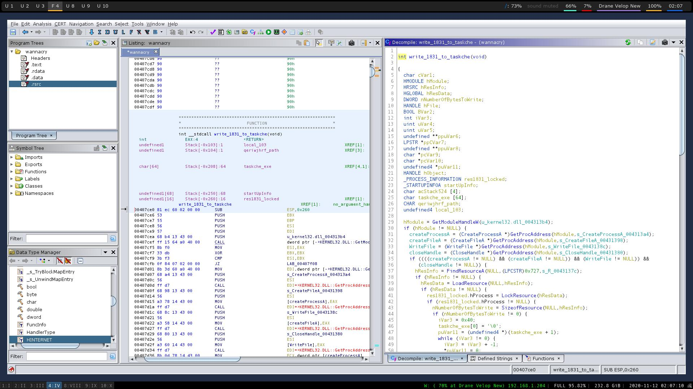
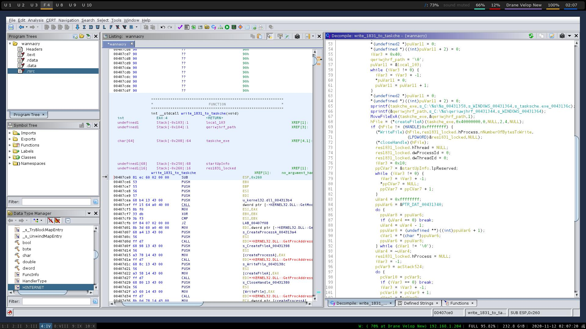
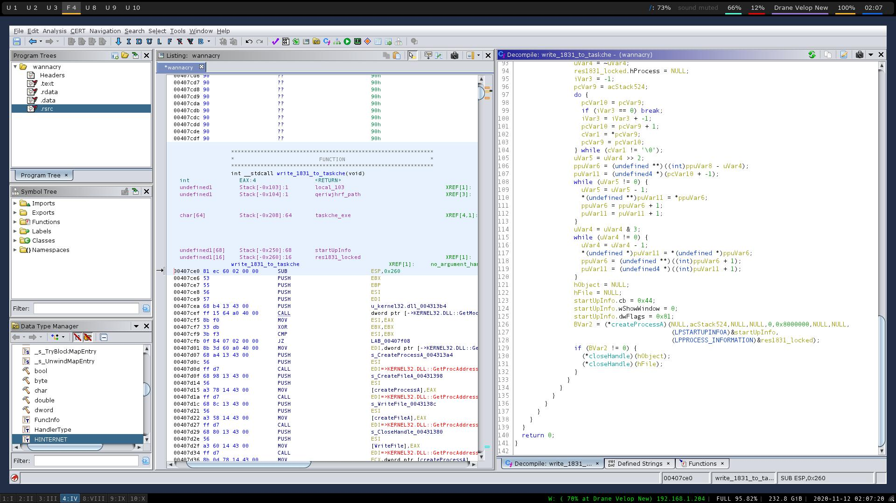

# Wannacry Decompiled 2.0 Write Up part 1

## Disclaimer

The images that will be in the write up are from my ghidra project I have already messed with. Functions will be renamed and so will variables. Keep in mind this is not a write up on how to reverse Windows binaries. This is a write up on how I went through and reversed the Wannacry virus. With this disclaimer out of the way onto the write up,

## Why I am doing this

I am reversing the Wannacry virus a second time mainly because I can. But mostly because I had used other resources the first time I reversed it and the decompilation didn't work out as well as I wanted it too. It was also the first Windows and big reverse engineering project I had ever done. But I came back to not only understand it with very little resources besides the Windows documentation and previous knowledge but also have an understanding of the underlying vulnerability that it used. With that being said the source code from my representation will be available. Please give me time to reverse it all so everyone can hopefully understand it. 

## Finding the Main Function

I first downloaded Wannacry and threw it into Ghidra. I just wanted to get straight to reversing it. After making a project and loading it into Ghidra I searched for a main function. For windows it can be `main` or `WinMain`. Since I couldn't find any of those I searched for entry.


The entry function will call main when the application is ran. So I scrolled all the way down and right before the exit function I found Wannacry's main function. 



## Finding the Killswitch and Reversing the WinMain function

I went into the function and edited the function signature to match `WinMain`. After that I spent some time cleaning up the code to make it as easy to understand as possible.



As you can see there is a strange url. So at first I had called it strange_url. Come to find out it was actually the killswitch url that Marcus Hutchins had found to ultimately kill the virus. (He had made a sinkhole for it. As of right now I am trying to figure out how to make on so one day I could possibly use it for research.). So I had renamed strange_url to killswitch_url. Next is a while loop and this is where ghidra seemed to fail at determining it was strncpy. I have no clue why that is but if you use retdec you will see that it is a strncpy. (In my source code file you will see there is no strncpy. That is mainly do to just putting the whole url string into InternetOpenUrlA). Next it initializes internet functionality to the virus and then opens the url. Next it checks to to see if the url is reachable if it is it will close the internet handles and call to the real main function.

## Reversing Wannacry's Real Main



Jumping into the real main function you will see variables with the type `SC_HANDLE`. What is `SC_HANDLE` you may ask if you have never seen that type in your life. That variable type is just a service control handle. So the real main function will get a Module File. Then check to see if there is any arguments. If there are no arguments it will call the function I named `no_argument_handler`. The rest of the function is just basic service control stuff for Windows. The more exciting part is the `no_argument_handler` function.

## Wannacry's No Argument Handling and The functions it calls



This function just calls two functions. I told you it was exciting. Lets just jump into the first function which i called `create_service`.



The create service function is small and pretty self explanatory. It will open a service manager, if the service manager is not null it will create a service called `mssecsvc2.0` with the display name `Microsoft Security Center (2.0) Service` with all access rights with what the executable arguments give it. (So basically from my understanding is it gives the application administrator rights. I could be wrong on that I didn't bother to 100% understand what that whole function Microsoft `CreateServiceA` function does). It then starts that service. I will now jump on to the next function `no_argument_handler` called. This function is the biggest function I decompiled in the wannacry virus binary so I will break it up into two parts. 

### Big Function Part 1



So what the first part of this function does is it will call for the `kernel32.dll` module. It will then check if its not null. If it is not null it will get the process address of 4 functions `CreateProcessA`, `CreateFileA`, `WriteFile`, `CloseHandle`. It will then check to see if it can find those functions if it can then will find a resource called `1831`. We will come back to this part in a minute. It will then load the resource and call LockResource. LockResource just retrieves a pointer to the resources data. It will then get the size of the resource. That is what the first part of the function does. Onto the second part.

### Big Function Part 2





The second part seems really complex when looking at it in Ghidra. Well thats because Ghidra seemed to fail again. The while loop is just a memset that looks like `memset(taskche_exe, 0, 64);` it also does that for `qeriwjhrf_path`. Then it makes two calls to `sprintf`. The first `sprintf` call puts the value `C:\WINDOWS\taskche.exe` into `taskche_exe`. The second call puts the value `C:\WINDOWS\qeriuwjhrf` into `qeriwjhrf_path`. It will then move `taskche.exe` to `C:\WINDOWS\qeriuwjhrf` and create a file handle to it. If the file handle is not null it will write the resource `1831` to `taskche.exe` then close the file handle. The next big while loop Ghidra did the same thing to us. It failed to recognize `strcat`. All it does is combine two strings together `taskche.exe /i`. It will then create the process `taskche.exe` with the resources `1831` process information.

## Naming The Big Function and Extracting Resource 1831

So with the two part analysis on the big function I decided to name it `write_1831_to_taskche` because all it does is writes the resource `1831` to `taskche.exe`, So how do we find that resource? Well there is a nice tool called `wrestool` on linux. (I don't know if you can get it on Windows), The tool will extract resources from windows executables. If you type `wrestool wannacry` you will see that it prints out
```
--type='R' --name=1831 --language=1033 [offset=0x3100a4 size=3514368]
--type=16 --name=1 --language=1033 [type=version offset=0x66a0a4 size=944]
```
Those are the resources wannacry has in the binary. To extract the resource `1831` we would type `wrestool --name=1831 -R -x wannacry > 1831.bin`. Now that we extracted that resource we can reverse engineer it. But that will be in Part 2 of this small series.

## Wrapping up

From starting with decompiling Wannacry to finding the infamous killswitch to then finding resource `1831` I would say we have come a decently long way. In part 2 of this series I will explain what is in the `1831` resource.